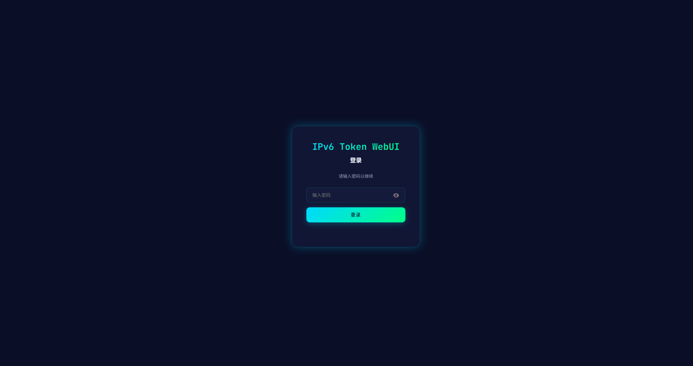
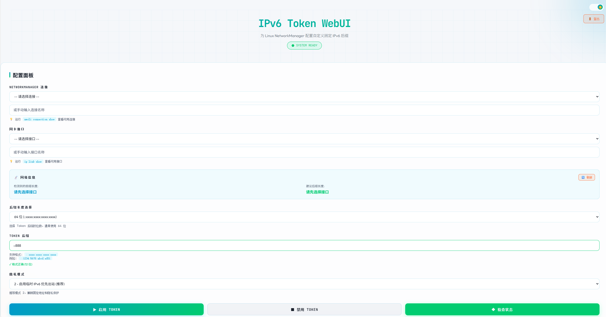
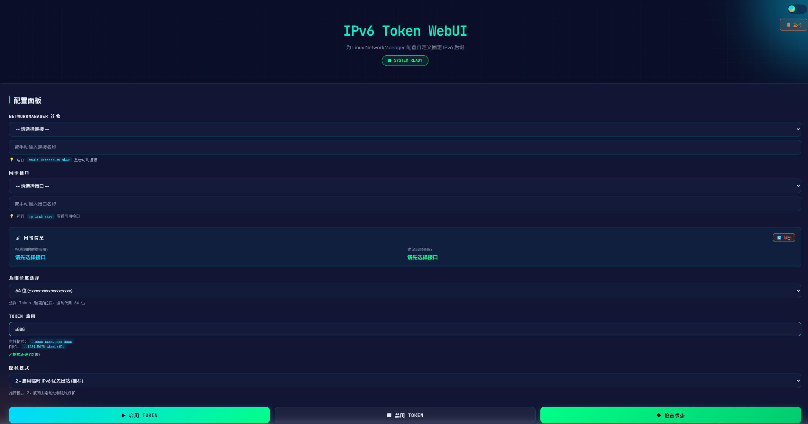

# IPv6 Token WebUI 使用指南

## 文档说明

**项目名称**: IPv6 Token WebUI  
**版本**: 1.0.0  
**创建日期**: 2025-01-26  
**适用系统**: Debian 12、Ubuntu 20.04+、飞牛NAS 等使用 NetworkManager 的 Linux 系统

---

## 目录

1. [为什么创建这个项目](#为什么创建这个项目)
2. [项目特点](#项目特点)
3. [快速开始](#快速开始)
4. [使用说明](#使用说明)
5. [界面示例](#界面示例)
6. [常见问题](#常见问题)
7. [技术细节](#技术细节)

---

## 为什么创建这个项目

### 背景

在使用 IPv6 的过程中，我们经常遇到以下问题：

1. **IPv6 地址频繁变化** - 每次重启或重新连接网络，IPv6 地址都会改变
2. **远程访问困难** - 地址变化导致无法稳定访问家里的 NAS 或服务器
3. **DDNS 频繁更新** - 需要不断更新动态 DNS 记录
4. **命令行操作复杂** - 需要记住复杂的 `nmcli` 和 `ip` 命令

### 解决方案

IPv6 Token 模式可以让你**自定义固定的 IPv6 后缀**（如 `::888`），这样：

- ✅ IPv6 地址固定不变（前缀变化，后缀固定）
- ✅ 方便远程访问和端口转发
- ✅ 不暴露 MAC 地址（比 EUI64 更安全）
- ✅ 易记易用（`::888` 比随机地址好记多了）

### 为什么需要 WebUI

之前我写了一套 Shell 脚本来配置 Token（见 [sh/token-eui64/README.md](../sh/token-eui64/README.md)），但是：

- ❌ 需要 SSH 登录服务器
- ❌ 需要手动编辑脚本修改参数
- ❌ 命令行操作对新手不友好
- ❌ 没有可视化的状态查看

所以我创建了这个 **WebUI 项目**，让配置变得简单：

- ✅ 浏览器访问，无需 SSH
- ✅ 图形化界面，一键操作
- ✅ 实时查看 IPv6 状态
- ✅ 支持 Docker 快速部署

---

## 项目特点

### 核心功能

- 🎯 **一键启用/禁用 Token** - 无需记忆复杂命令
- 📊 **实时状态查看** - 显示当前 IPv6 地址、Token 配置、网络接口信息
- 🔐 **密码保护** - 首次访问设置密码，后续需要登录
- 🎨 **现代化界面** - 响应式设计，支持深色/浅色主题
- 📝 **操作日志** - 记录所有配置操作，方便排查问题

### 技术特点

- ⚡ **单一可执行文件** - 基于 Rust 编译，无需外部依赖
- 🐳 **Docker 支持** - 一条命令快速部署
- 🔒 **安全防护** - 输入验证、命令注入防护、Argon2id 密码哈希
- 💾 **低资源占用** - 内存 < 10MB，启动 < 1秒
- 🌐 **跨架构支持** - x86_64、ARM64、ARM32

---

## 快速开始

### 方式一：Docker 部署（推荐）

**适用场景**: 快速体验、生产环境

```bash
# 1. 拉取项目
git clone https://github.com/MG5921MY/token64-eui-webui-public.git
cd token64-eui-webui-public/code

# 2. 启动服务（使用远程镜像）
docker compose -f docker-compose.remote.yml up -d

# 3. 访问 WebUI
# 浏览器打开: http://服务器IP:5000
# 首次访问需要设置密码（至少 6 位）
```

**配置持久化**: 配置文件保存在 `./config/config.yaml`，重启容器不会丢失。

### 方式二：直接运行二进制文件

**适用场景**: 不想使用 Docker、需要自定义配置

```bash
# 1. 下载或编译二进制文件
cd code
cargo build --release

# 2. 运行程序
./target/release/ipv6-token-webui

# 3. 访问 WebUI
# 浏览器打开: http://localhost:5000
# 首次访问需要设置密码
```

**监听地址说明**:
- 默认监听 `127.0.0.1:5000`（仅本地访问）
- 远程访问需要使用 `-H 0.0.0.0` 参数
- 详细配置见 [code/网络监听地址配置说明.md](../code/网络监听地址配置说明.md)

### 方式三：飞牛 NAS FPK 安装

**适用场景**: 飞牛 NAS 用户

1. 下载 FPK 文件（或自己打包）
2. 在飞牛 NAS 应用中心上传安装
3. 启动应用
4. 浏览器访问 `http://NAS_IP:5000`

---

## 使用说明

### 首次使用

1. **设置密码**
   - 首次访问会提示设置密码
   - 密码至少 6 位
   - 输入密码与确认密码后，点击“设置密码”完成初始化

2. **登录系统**
   - 打开登录页面，输入密码
   - 点击“登录”进入主界面

### 主界面功能

#### 1. 系统信息面板

显示当前系统的网络配置信息：

- **网络接口**: 当前使用的网卡名称（如 `eth0`）
- **连接名称**: NetworkManager 连接名称
- **IPv6 地址**: 当前所有 IPv6 地址
- **Token 状态**: 是否已启用 Token，当前 Token 值

进入主界面后即可看到系统信息面板。

#### 2. Token 配置面板

**启用 Token**：

1. 在输入框中输入自定义后缀（如 `::888`）
2. 点击“启用 Token”按钮
3. 等待几秒，系统会自动配置
4. 刷新页面查看新的 IPv6 地址

**推荐 Token 后缀**:
- `::888` - 简洁易记
- `::1` - 最简洁
- `::abc` - 自定义字母
- `::2024` - 自定义数字

**禁用 Token**：

1. 点击“禁用 Token”按钮
2. 系统会恢复默认配置（DHCPv6 或 SLAAC）
3. 刷新页面查看变化

#### 3. 操作日志面板

实时显示所有操作的执行日志：

- 命令执行过程
- 成功/失败状态
- 错误信息（如果有）
- 时间戳

进行“启用/禁用 Token”等操作后，下方日志区域会实时滚动显示执行过程。

### 高级功能

#### 修改密码

```bash
# 使用 CLI 命令修改密码
./ipv6-token-webui --set-password

# Docker 环境
docker exec -it ipv6-token-webui ipv6-token-webui --set-password
```

#### 自定义监听地址

```bash
# 仅本地访问（最安全）
./ipv6-token-webui -H 127.0.0.1 -p 5000

# 允许远程访问（需配合防火墙）
./ipv6-token-webui -H 0.0.0.0 -p 5000

# 自定义端口
./ipv6-token-webui -H 0.0.0.0 -p 8080
```

---

## 界面示例

### 1. 首次登录设置密码


### 2. 登录界面



### 3. 主界面（亮色）



### 4. 主界面（暗色）



---

## 常见问题

### 1. 无法访问 WebUI？

**检查清单**:

```bash
# 1. 检查服务是否运行
docker ps | grep ipv6-token-webui
# 或
ps aux | grep ipv6-token-webui

# 2. 检查端口是否监听
netstat -tlnp | grep 5000

# 3. 检查防火墙
ufw status
# 如果启用了防火墙，需要开放 5000 端口
ufw allow 5000/tcp
```

### 2. Token 配置后没有生效？

**可能原因**:

1. **路由器未启用 SLAAC** - 检查路由器 IPv6 配置，确保 A flag=1
2. **网络连接未重启** - 等待 10-30 秒让系统重新获取地址
3. **DHCPv6 优先级更高** - 如果同时有 `/128` 和 `/64` 地址，系统可能优先使用 `/128`

**解决方案**:

```bash
# 查看当前地址
ip -6 addr show eth0 | grep "scope global"

# 如果有多个地址，检查哪个包含你的 Token
# 例如: 2001:db8:1234:5678::888/64 ← 这是 Token 地址
```

### 3. 忘记密码怎么办？

```bash
# 删除配置文件，重新设置密码
rm -f config/config.yaml

# 重启服务
docker compose -f docker-compose.remote.yml restart
# 或
systemctl restart ipv6-token-webui
```

### 4. Docker 容器启动失败？

**检查日志**:

```bash
# 查看容器日志
docker logs ipv6-token-webui

# 常见错误:
# - "Permission denied" → 需要 NET_ADMIN 权限
# - "Address already in use" → 5000 端口被占用
# - "D-Bus connection failed" → 需要挂载 /var/run/dbus
```

### 5. 如何在路由器配置端口转发？

**步骤**:

1. 登录路由器管理界面
2. 找到"IPv6 端口转发"或"IPv6 防火墙"设置
3. 添加规则：
   - 目标地址: `2001:db8:1234:5678::888`（你的 Token 地址）
   - 端口: 需要转发的端口（如 22, 80, 443）
   - 协议: TCP/UDP
4. 保存并应用

### 6. 重启后配置丢失？

**不会丢失！** NetworkManager 的配置是持久化的：

```bash
# 重启后检查
reboot

# 重新登录后查看
ip -6 addr show eth0 | grep "scope global"
nmcli connection show "Wired connection 1" | grep ipv6

# 配置应该仍然存在
# 如果地址未生效，手动重启连接:
nmcli connection up "Wired connection 1"
```

---

## 技术细节

### 架构设计

```
┌─────────────────────────────────────────┐
│         Web Browser (用户)              │
└─────────────────┬───────────────────────┘
                  │ HTTP/HTTPS
                  ↓
┌─────────────────────────────────────────┐
│      Actix-Web Server (Rust)            │
│  ┌─────────────────────────────────┐   │
│  │  认证中间件 (Argon2id)          │   │
│  └─────────────────────────────────┘   │
│  ┌─────────────────────────────────┐   │
│  │  API 路由                       │   │
│  │  - /api/auth/*                  │   │
│  │  - /api/system/info             │   │
│  │  - /api/ipv6/*                  │   │
│  └─────────────────────────────────┘   │
│  ┌─────────────────────────────────┐   │
│  │  命令执行器 (安全验证)          │   │
│  └─────────────────────────────────┘   │
└─────────────────┬───────────────────────┘
                  │ 系统调用
                  ↓
┌─────────────────────────────────────────┐
│      NetworkManager (D-Bus)             │
│  - nmcli connection modify              │
│  - ip addr / ip token                   │
│  - sysctl net.ipv6.*                    │
└─────────────────────────────────────────┘
```

### 安全特性

1. **认证系统**
   - Argon2id 密码哈希（行业标准）
   - 会话管理（UUID v4 会话 ID）
   - 登录失败追踪（5 次失败锁定 15 分钟）

2. **输入验证**
   - 正则表达式严格验证所有输入
   - Token 格式验证（`::[0-9a-f]+`）
   - 长度限制和特殊字符过滤

3. **命令注入防护**
   - 使用参数数组而非 shell 字符串
   - 命令白名单机制
   - 路径规范化验证

4. **并发控制**
   - 最多 5 个并发命令
   - 60 秒超时自动终止
   - 速率限制（每秒 2 个请求）

详细安全说明请查看 [安全说明.md](安全说明.md)

### 性能指标

| 指标 | 数值 |
|------|------|
| 二进制大小 | ~4MB |
| 内存占用 | <10MB |
| 启动时间 | <1秒 |
| 响应时间 | <50ms |

### 依赖项

**系统依赖**:
- NetworkManager
- iproute2
- sysctl

**Rust 依赖**:
- actix-web 4.x - Web 框架
- tokio - 异步运行时
- serde - 序列化/反序列化
- argon2 - 密码哈希
- uuid - 会话 ID 生成

---

## 相关文档

- [项目主 README](../README.md) - 项目概述和快速开始
- [CLI 使用指南](../code/CLI使用指南.md) - 命令行参数说明
- [Linux 部署指南](../code/Linux部署指南.md) - 完整部署教程
- [Docker 部署说明](../code/Docker部署说明.md) - Docker 详细配置
- [安全说明](安全说明.md) - 安全特性详解
- [原始脚本说明](../sh/token-eui64/README.md) - Shell 脚本版本（历史参考）

---

## 贡献与反馈

- **GitHub 仓库**: https://github.com/MG5921MY/token64-eui-webui-public
- **问题反馈**: https://github.com/MG5921MY/token64-eui-webui-public/issues
- **作者**: clearlove.ymg
- **许可证**: MIT License

---

## 更新日志

**v1.0.0** (2025-01-26)
- ✨ 首次发布
- ✅ 支持 Token 启用/禁用
- ✅ 实时状态查看
- ✅ 密码认证保护
- ✅ Docker 部署支持
- ✅ 飞牛 NAS FPK 打包

---

**现在就开始使用吧！** 🚀

```bash
# Docker 快速启动
cd code
docker compose -f docker-compose.remote.yml up -d

# 访问 http://服务器IP:5000
```
